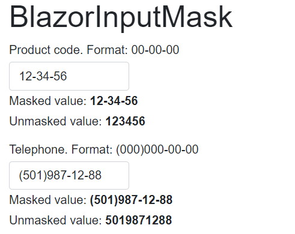

# BlazorInputMask

## Summary

A masked textbox for Blazor based on iMask.js




Available on Nuget as PPioli.BlazorInputMask.


### How to use it

In your _Imports.razor file add

```
@using BlazorInputMask
```

Now you can add the input in any of your components

```
  <InputMask></InputMask>
```


Customize with:

* @bind-Value: Binds the masked value to a string.
* @bind-RawValue: Binds the unmasked value to a string.
* DataMask: Set the mask to use. Check all available options in https://imask.js.org/guide.html.

Check the included sample to see it live.
